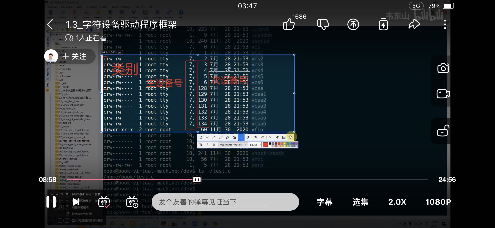
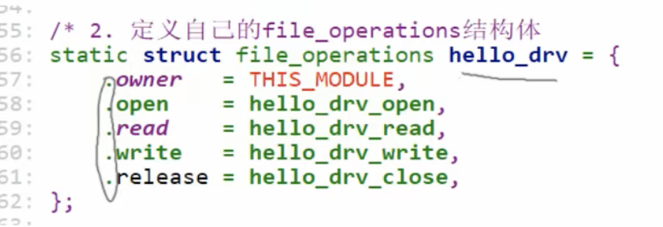
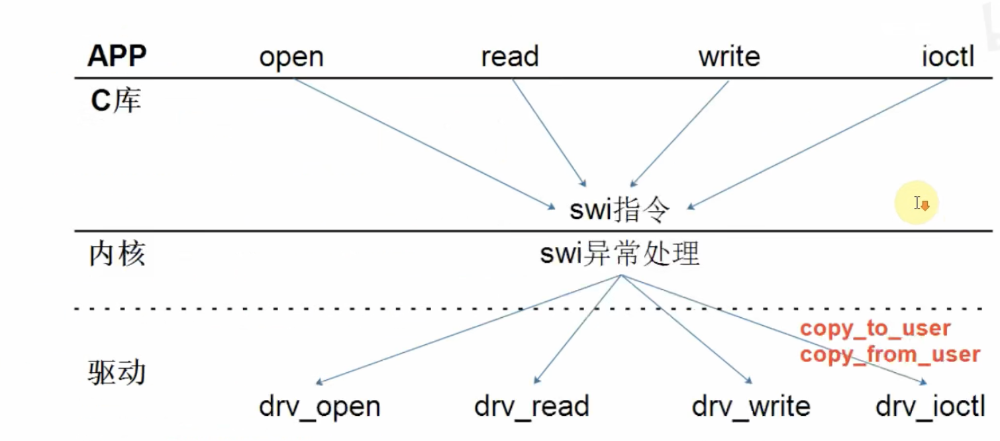

# SOC


## guideline


> Key area：U-boot，linux内核，linux设备驱动，应用层项目
>
> 
>
> 知识体系复杂，不要钻在某一个子问题，应该先快速入门，边学边补：
>
> 基本认知》linux/工具基础》搭建环节》》APP开发基础 》驱动基础 》项目
>
> 所以，可以先掌握必备的APP基础、驱动基础，然后马上开始学习项目开发，以后想深入时，再去学习相关的专题。


-------------

可能需要理解的知识：

1.命令行工具的使用：gcc，make，交叉编译gcc，gdb，cmake，objdump，fdisk，dmesg，mkfs, systemctl，inxi...


2.交叉编译链的配置和使用 （使用前，要提前运行环境）


3.内核的配置与编译（make menuconfig）


4.基础的驱动，比如GPIO(控制）、UART(数据传输）、SPI、I2C、LCD、MMC，高级的驱动，比如USB、PCIE、HDMI、MIPI、GPU、WIFI、蓝牙、摄像头、声卡。


 5.标准系统库的使用：glibc，gcc，libstdc++（使用man 查询文档，标准化使用内核态的功能）


6.多线程


7.板级通信，板间通信


8.性能优化：内存泄漏，进程管理 （使用ebpf）

------------


## Configuration过程


### 板子与linux主机通信方式

#### 1:网线连接：使用ifconfig分别为linux有线网口，板子有线网口设置同一网段的ip地址

ip address：192.168.1.100


方法1：soc 直接连接 linux主机 ：网线连接，使用静态路由：把网口的IP固定

修改配置文件

sudo systemctl restart networking


方法2:soc+路由器+linux：可以使用有线或者无线连接，路由器开启DHCP


linux端使用ssh则可以直接访问


#### 2.串口通信：通过UART链接，使用putty串口连接

~~~linux
1.
ls -l /dev/tty*     //查看设备节点的权限
// tty设备：前身打字机。现在允许用户输入，在计算机上查看输出，通常与串口相连接的设备。实体设备（USB tty），软件设备（终端，终端模拟器
Note：串口：UART，RS-232   /dev是一个虚拟文件系统，用于访问设备和设备文件，包含了所有可用的文件（没有对应驱动可能没有显示）
2.
chmod 666 /dev/ttyUSB0     //暂时打开权限

3.使用putty直接与tty设备建立连接
使用serial连接
~~~


### 开启NFS(文件共享)

linux安装nfs，把某目录配置为nfs，然后使用soc将该目录挂载到自己的目录中进行访问

~~~linux

1.先确定设备之间可以连通（处于一个局域网）
2.sudo apt-get install nfs-kernel-server
3. sudo mkdir /home/myshare
4.sudo vim /etc/exports
5./home/myshare  *(rw,sync,no_subtree_check)
6.sudo systemctl restart nfs-kernel-server

soc：
sudo mount ip:/home/myshare /mnt/location
~~~


### 新板子提供SDK，进行配置并启动SOC

一个嵌入式SDK包含：交叉编译工具链，操作手册，源代码（库和头文件），调试烧录工具/脚本，内核

1.安装编译环境(shell)

启动编译环境，才能使用aarch64-pock-linux-gcc

>重启linux或者打开新的shell都需要重新执行启动环境。（同一个shell属于一个进程组）

2.解压，按照makefile编译生成镜像/内核/其他程序


3.烧写镜像到sd卡中，soc使用sd卡/emmc启动板子

~~~linux
相关指令：

lsblk  //查看挂载情况，找到sdx
blkid  //检查sd卡文件类型
fdisk dev/sdx //进行分区
mkfs ext4 /dev/sdx   //格式化
mount /dev/sdx /xxpath  //挂载


~~~

case one：全新的sd卡

case two：已经有内容

先格式化再分区


### **编译内核**

1.配置编译内核 （顺便dtb，driver module ---》 dtb /lib）

>linux kernel,dtb,lib的关系：Linux Kernel通过驱动程序来控制硬件设备，其中驱动程序可以直接编写在内核中，也可以以模块的形式加载。驱动程序需要知道硬件设备的地址、中断、时钟等信息，这些信息可以通过读取DTB文件来获取。应用程序可以使用库来访问硬件设备，这些库通常使用Linux Kernel提供的驱动程序来控制硬件设备。
>
>下载的linux kernel是否包含：下载的Linux Kernel包中只包含内核代码和相关工具，不包含DTB和库。DTB文件是针对特定硬件平台生成的，它描述了设备的硬件配置和资源分配等信息。下载的Linux Kernel包中只包含内核代码和相关工具，不包含DTB和库。DTB文件是针对特定硬件平台生成的，它描述了设备的硬件配置和资源分配等信息。因此，DTB文件需要根据具体的硬件平台进行生成，一般由硬件厂商或开发者根据硬件平台的特性进行制作。DTB是在linux配置编译时生成。


基于makefile：

配置      make config  // make menuconfig    配置完成后会生成.config文件

> 驱动程序中头文件来自于内核，依赖于内核源码，要进行内核配置，然后编译内核。驱动和内核是配套的。

编译：

make  / make all（全编译）

make clean

make install

make <target>  // 快速编译

make <module>

make -j4 //多核心运行

2.移植到板子上 

~~~linux
连接串口，设置开发版启动模式
1.将新的内核镜像文件和相应的设备树文件（DTB）拷贝到目标设备的/boot下
cp /mnt/ZImage /boot  //
cp /mnt/xx.dtb /boot  //
cp /mnt/lib/modules /lib -rfd //更新模块   （覆盖目录）

2.修改引导配置文件，将新的内核镜像文件和设备树文件设置为启动时使用的内核和设备树
 sudo nano /boot/config.txt
 kernel=zImage
 device_tree=bcm2708-rpi-b.dtb
 
sync 
reboot


//驱动程序

更改makefile的内核路径
然后： insmod xxxx.ko
rmmod xxx.ko
~~~


### gcc

预处理，编译，汇编，链接

-c：汇编，但不链接

-o：生成 xx

-I：指定头文件目录 （某人的头文件是放在/usr中

-L：链接时候库文件

>
>
>静态库：编译后不链接生成xx.o, 使用ar压缩。-》xx.a
>
>动态库：.so文件

当有多个.c文件和头文件时候，应该把编译和链接的过程分开，集中在一起销量不高


### makefile

~~~linux
// main.c and test.c

test: main.o test.o
	gcc -o test main.0 test.o
	
main.o: main.c
	gcc -c -o main.o main.c

test.o: test.c
	@gcc -c -o test.o test.c   ///@则运行时，不会显示本身

后两条或者：
%.o:%.c
	gcc -c -o $@ $<

	
//运行规则：
1.当目标文件不存在时，执行规则
2.当依赖文件比目标文件新时，执行规则
3.通配符的使用 $@(表示目标） $< (表示第一个依赖文件 $^(表示所有依赖文件）
4.假想目标.PHONY （例如：本项目中可能有文件于clean重名）   .PHONY: clean
5.变量：多种方式 := 即时变量 出现就被定义好了  = 延时变量 需要用的时候才初始化确定
6.make后不带目标则去生成第一个规则的第一个目标，否则：make clean
7.makefile自带函数 filter，wildcard，filter-out
8.工程的子目录下也可以有makefile，在主makefile中递归的调用它们
ex：make -C /a -f $(TOPDIR)/Makefile.build   (makefile.build是子目录的makefile）
~~~


## 文件


文件（linux中一切且文件）

1.挂载各种sd卡，硬盘，flash，u盘。访问硬件上的各种真实普通文件 

2.linux内核提供的虚拟文件系统： /proc （内核信息）

3.特殊文件：/dev 设备文件 （设备节点，通过驱动程序去访问硬件）字符设备（tty）+块设备（sd*）


> （Linux下的设备通常分为三类，字符设备，块设备和网络设备。
> 设备驱动程序也分为对应的三类：字符设备驱动程序、块设备驱动程序和网络设备驱动程序。
> 常见的字符设备有鼠标、键盘、串口、控制台等。
> 常见的块设备有各种硬盘、flash磁盘、RAM磁盘等）


#### /dev 目录详解

描述硬件设备，用于内核（驱动）与应用层程序之间交互的通道。

设备对象（块设备，字符设备，网络设备）  2. 设备驱动程序（设备驱动程序负责将设备对象映射到设备节点，处理中断） 3. 设备节点


设备节点：/dev目录下都是设备节点。它用于连接用户程序和设备驱动程序，每个设备节点都对应一个特定的设备对象，用户程序可以通过设备节点来操作设备，从而控制设备的操作。使用标准的POSIX接口函数(read, write, ioctl等)可以操作大多数设备节点，而无需了解具体的设备类型和驱动程序。


>一个设备可以对应多个设备节点是因为在Linux系统中，每个设备节点都是一个文件，通过这个文件可以访问设备驱动程序提供的设备功能。对于同一个设备，不同的设备节点可以提供不同的访问权限和访问方式，例如读写、控制等等。
>
>例如，对于一个USB摄像头设备，它可以对应多个设备节点，例如/dev/video0、/dev/video1等等。这些设备节点可以提供不同的访问方式，例如使用视频采集软件来捕获视频流、使用控制台命令来控制摄像头的参数等等。
>
>另外，一个设备可以通过多种总线类型连接到计算机上，例如USB、PCI、串口等等。每种总线类型都有自己的设备驱动程序和设备节点，因此同一个设备在不同的总线类型下可以对应不同的设备节点。

#### 单片机mcu和mpu/soc的区别？

MCU 单片机：c语言使用芯片厂商提供的很多库函数，直接控制寄存器来操作硬件（点亮小灯） 《直接访问硬件》

（应用程序和驱动程序没有明显的界限）


MPU linux嵌入式：c程序中无法直接读写寄存器，通过驱动程序。（加上了操作系统层，权限级 ） 《不能直接访问硬件》

应用程序和驱动程序有明显的界限  ex：必须使用标准库glibc的open，read，write才能访问驱动程序 （触发中断 用户态-》内核态）


#### MPU应用层程序如何与驱动程序联动

1.应用层使用标准库函数ex open read write实现逻辑 （库函数内部触发中断swi software interrupt）

中断设置某寄存器value

2.陷入内核态，中断处理函数根据value，寻找到对应的驱动程序

驱动程序 = 支持标准库调用的框架 + 硬件操作


```linux
fd = open("/dev/led0", **)   //通过open找到对应的驱动程序，并返回相关信息在结构体fd中。/dev/led0 与 test.txt的区别，是根据文件类型来进行不同的操作（字符类型vs 普通文件）

1.确定为led为字符设备，对应一个字符驱动结构体数组
cat /proc/devices  查看已经支持的设备有哪些，
主设备号标识设备类型 来确定对应驱动程序
次设备号用于标识同一类型设备中的不同设备，每个设备的次设备号都是唯一的

开发驱动程序：

1.选择空闲的主设备号

2.创建包含众多file_operations的驱动函数的结构体(该类型的驱动程序应该执行什么逻辑 ex对于open的驱动实现）

3.注册：把结构体放到字符驱动程序中（数组或链表），通过主设备号调用

module_init(xxx)
//把xxx作为驱动的入口函数注册：把刚写的驱动结构体放到字符结构体数组中


具体流程可以查看：https://www.bilibili.com/video/BV1Yb4y1t7Uj?p=5&vd_source=8c2c0205fb00c73b1b17ce2d2925d1de
```








case 1:对于文件，都可以用标准的接口去访问他们 （open/read/write） 使用man 命令去查找具体的使用方法 

```c
///例如一个用glibc库实的复制读写的程序，read/write/open 使用 man 2 xxx 查看手册，看看参数怎么用

#include<sys/types.h>
#include<sys/stat.h>
#include<fcntl.h>
#include<unistd.h>
#include<stdio.h>

int main(int argc, char **argv){

    int fd_old, fd_new;
    char buffer[1024];
    int len;

    if(argc != 3){
        printf("Usage: %s <old-file> <new-file>\n", argv[0]); 
        return -1;
    }

    fd_old = open(argv[1], O_RDONLY);
    if(fd_old == -1){
        printf("you can't open file %s", argv[1]);
        return -1;
        
    }
  
    fd_new = open(argv[2], O_WRONLY | O_CREAT | O_TRUNC , S_IRUSR |S_IWUSR| S_IRGRP |S_IWGRP|S_IROTH|S_IWOTH);
    if(fd_new == -1){
        printf("can't create the file %s\n", argv[2]);
        return -1;
    }
    
    while((len = read(fd_old, buffer, 1024)) > 0){
        if(write(fd_new, buffer, len) != len){
            printf("can't write %s\n",argv[2]);
            return -1;
        }
    }

    close(fd_old);
    close(fd_new);

    return 0;


}
```


case 2:framebuffer上数据影响LCD屏幕输出


LCD控制器定期去内存framebuffer中读取每个像素点对应的数据


bpp：bits per pixel（屏幕上一个像素点需要用几个字节来表达，RGB，透明度。。。）

r行c列： framebuffer[r* 列数 + c]*bpp/8 进行设置

mmap函数奖framebuffer映射到用户空间进行操作

```c
fd_fb = open("/dev/fb0", O_RDWR);
if(fd_fb <0){
  printf("can't open fb0\n");
}
static struct fb_var_screeninfo var;   //可变信息用一个定制的结构体来接收 ：bpp，分辨率。。。

//ioctl函数也是标准库函数
if(ioctl(fd_fb, FBIOGET_VSCREENINFO,&var)){
  
  printf("can't get var\n");
  return -1;}    //获取屏幕的可变信息

 line_width = var.xres * var.bit_per_pixel /8; 
 pixel_width = var.xres * var.yres * var.bit_per_pixel /8;
 fb_base = (unsigned char *)mmap(NULL, screen_size,....
  //获取到了buffer
                                 
                                 
  for(){}
                                 
  //for循环调用描点函数，绘制                               
                                 
  void lcd_put_pixel(int x,int y, unsigned int color){
    unsigned char *pen_8 = fb_base + y *line_width + x* pixel_width; //基地址 + 便宜的位置
    
  
                                 
 switch(var.bits_per_pixel){
   case 8:...
     
     case 16:
   {
     red = (color >> 16) &0xff;
     green = (color >>8) &0xff;
     blue = (color >>0) &oxff;
     color = ((red >>3) << 11) | ((green >>2)<< 5 ) (blue>>3);
     *pen = color;
   }
 }
                                
```


### 网络通信

TCP（可靠有连接） UDP（无连接不可靠）

客户端，连接，服务端 ：IP，端口


Socket是一个编程接口，不是一个网络协议，因此它并不位于TCP/IP五层模型中的任何一层。**Socket API是对网络协议栈的封装，使得应用程序可以方便地使用TCP/IP协议进行通信**。在TCP/IP五层模型中，Socket所使用的协议，如TCP和UDP，位于传输层。传输层是负责提供端到端的可靠数据传输服务的层次，它位于网络层和应用层之间。


> 客户端：
>
> socket创建客户端通信的套接字文件：指定通信的协议族和数据类型
> 使用connect主动向服务器发起连接请求，与服务器的accept实现三次握手建立连接。连接成功之后客户端可以通过socket返回的文件描述符进行通信 ，服务器使用accept返回的通信文件描述符进行通信
> 使用send/recv和服务器 发送接收数据进行通信
> 通信结束之后断开连接close或者shutdown

用户端：socket，bind，listen，


